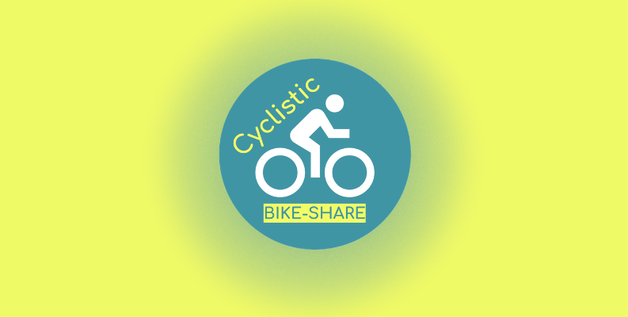

 

# 🔍 Google Data Analytics Capstone - Cyclistic

A data analytics case study to analyze 12 months of Cyclistic bike-share trip data to identify behavioral differences between casual riders and annual members for a targeted marketing strategy.

  

## ⚙ Tools Used
 - `SQL (BigQuery Sandbox)`
 - `Spreadsheet (Google Sheets)`
 - `Docs (Google Docs)`
 - `Presentation (Google Slides)`
 - `Tableau Public`
 - `Medium`  
  
 

## 🔗Links
📖 My Data Analysis Journey  
➔ [Read on Medium](https://medium.com/@hamdanyou2008/google-data-analytics-capstone-project-cyclistic-members-vs-casuals-48024ee0587c?sharedUserId=hamdanyou2008)  

🎤 Presentation of Analysis Results  
➔ [View Presentation on Google Slides](https://docs.google.com/presentation/d/1YqEgn3SXdByo9DPyD4zvNM9BJKzICwi2QqUjf-Sbtkc/edit?usp=sharing)  
➔ [View Presentation as PDF](https://github.com/hamdanriaz/cyclistic-data-analytics-capstone/blob/main/Google%20Capstone%20Project%3B%20Cyclistic%20Presentation.pdf)  

📄 Project Documentation  
➔ [View Documentation on Google Docs](https://docs.google.com/document/d/1KNQ4fqEXj-aaIRqkl6qsDYQZIMpsiOL1EgYNn7QTpfk/edit?usp=sharing)  
➔ [View Changelog on Google Docs](https://docs.google.com/document/d/1bEQuoADGepjVAteQeWndBS-qHLzfSbWLuZsljQBa604/edit?usp=sharing) 
➔ [View Documentation as PDF](https://github.com/hamdanriaz/cyclistic-data-analytics-capstone/blob/main/CASE%20STUDY%20DOCUMENTATION.pdf)  
➔ [View Changelog as PDF](https://github.com/hamdanriaz/cyclistic-data-analytics-capstone/blob/main/CHANGELOG.pdf)  
 
📊 Tableau Visualizations  
➔ [Visualizations in Tableau Public](https://public.tableau.com/shared/DGFZC76MM?:display_count=n&:origin=viz_share_link)  
➔ [Visualizations as Images](https://github.com/hamdanriaz/cyclistic-data-analytics-capstone/tree/main/Images)  

📊 Findings Spreadsheet  
➔ [View Findings on Google Sheets](https://docs.google.com/spreadsheets/d/1Z2uGUcvCmofwbTeVa3qoCe28FzGI9F9yAS5kLr5--cE/edit?usp=sharing)  
➔ [View Findings as PDF](https://github.com/hamdanriaz/cyclistic-data-analytics-capstone/blob/main/Findings.pdf)  
  
 

## 📙 Project Guide
1. Click the Article first... It contains my entire journey of the project
2. You can read the documentation next (Optional)
3. You can also read changelog after that (Optional)
4. Look at the interactive visualization from the Tableau Public Link (Recommended)
5. Go to the Presentation to see the Analysis Results
  
 

## 🧠 Skills Demonstrated
- `SQL (BigQuery)`
- `Data Cleaning & Transformation`
- `Exploratory Data Analysis (EDA)`
- `Customer Behavior Analysis`
- `Geospatial Analysis`
- `Data Visualization (Tableau)`
- `Dashboard Design`
- `Business Intelligence`
- `Data Storytelling`
- `Business Recommendations`
- `Technical Documentation`
- `Presentation & Stakeholder Communication`
- `Git & GitHub`
  
 

---
**Best viewing experience**: Documentation and presentation are available as interactive Google Docs/Slides with full formatting and working hyperlinks. PDF versions are also provided for convenient viewing directly on GitHub.
